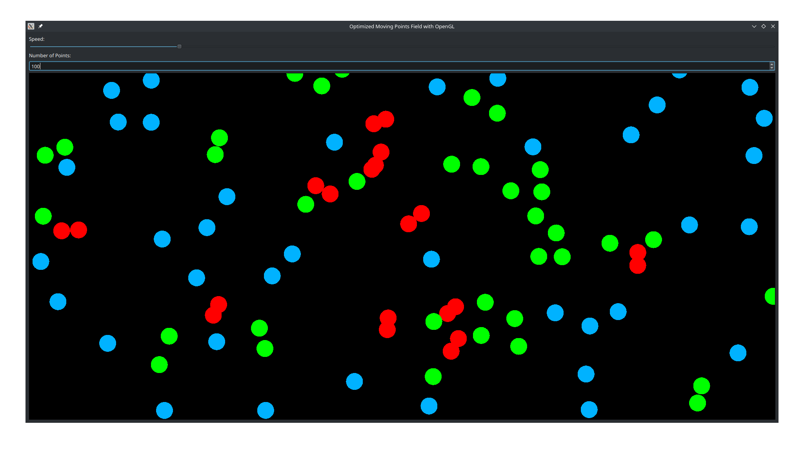

# drunk-cats

## Demo


## Setup
```
pip install -r requirements.txt
```
```
gcc -shared -o backend/libbackend.so -fPIC -O3 -ffast-math backend/library.c
```
## Run
```
python main.py --num-points 5
```

## Features

- The number of cats reaches 500000 and more
- Smooth rendering
- Cats can leave the map
- Zoom and drag the screen for better viewing experience

## License
Distributed under the MIT License. See [LICENSE](https://github.com/AzimMuradov/drunk-cats/blob/master/LICENSE) for more information.